# VectorDraw Pro

## 变更记录 (Changelog)

- **2025-12-03**: 初始化项目架构文档，生成项目模块索引和技术栈概览

## 项目愿景

VectorDraw Pro 是一个基于 Next.js 的现代化矢量图形编辑器，提供类似于 Draw.io 的绘图体验。该项目致力于构建一个功能丰富、用户友好的在线绘图工具，支持多种图形元素、实时编辑、导出功能等。

## 架构总览

### 技术栈
- **前端框架**: Next.js 16.0.6 (App Router)
- **UI 框架**: React 19.2.0 + TypeScript
- **样式系统**: Tailwind CSS 4.0
- **图形引擎**: Fabric.js 5.5.2
- **状态管理**: Zustand 5.0.1 + Immer 10.1.1
- **UI 组件**: Radix UI (对话框、下拉菜单、选择器等)
- **图标库**: Lucide React
- **测试框架**: Jest + Jest DOM
- **故事书**: Storybook 8.3.5
- **代码质量**: ESLint + TypeScript

### 核心功能模块

## 模块结构图

```mermaid
graph TD
    A["VectorDraw Pro"] --> B["🎨 UI Components"];
    A --> C["📐 Canvas Engine"];
    A --> D["🔧 Tools & Utilities"];
    A --> E["📊 Types & Definitions"];
    A --> H["🧩 Drawio Core"];
    A --> F["🖼️ Assets & Public"];
    A --> G["⚙️ Configuration"];
    
    B --> B1["UI Components"];
    B --> B2["Canvas Components"];
    
    C --> C1["Interactive Canvas"];
    C --> C2["Canvas Provider"];
    
    D --> D1["Constants (via Core)"];
    D --> D2["Utilities"];
    
    E --> E1["Type Definitions"];
    E --> E2["API Types"];
    
    F --> F1["Public Assets"];
    F --> F2["Favicons"];
    
    G --> G1["Build Config"];
    G --> G2["Test Config"];
    G --> G3["Lint Config"];
    
    click B1 "./src/components/ui/CLAUDE.md" "查看 UI 模块文档"
    click B2 "./src/components/canvas/CLAUDE.md" "查看 Canvas 模块文档"
    click C1 "./src/components/CLAUDE.md" "查看 Canvas Components 文档"
    click E1 "./src/types/CLAUDE.md" "查看 Types 模块文档"
    click H "./packages/drawio-core/README.md" "查看 Drawio Core 文档"
```



## 模块索引

| 模块 | 路径 | 类型 | 描述 | 技术栈 |
|------|------|------|------|--------|
| 🎨 UI Components | `src/components/ui/` | React 组件 | 通用 UI 组件库 | Radix UI + Tailwind |
| 📐 Canvas Components | `src/components/` | React 组件 | 画布相关组件 | Fabric.js + SVG |
| 🧩 Type Definitions | `src/types/` | TypeScript | 类型定义文件 | TypeScript |
| 🧩 Drawio Core | `packages/drawio-core/` | 共享包 | 核心绘图逻辑与常量 | TypeScript |
| 🖼️ Public Assets | `public/` | 静态资源 | 图标和公共文件 | SVG |
| 📱 App Router | `app/` | Next.js | 应用路由和布局 | Next.js 16 |
| ⚙️ Configuration | 根目录 | 配置文件 | 构建和开发配置 | 各种工具配置 |

### 核心模块详情

#### 🎨 UI Components (`src/components/ui/`)
- **职责**: 提供可复用的 UI 组件
- **主要文件**: `Button.tsx`, `Input.tsx`, `utils.ts`, `index.ts`
- **特性**: 基于 Radix UI，支持主题定制，完整的 Storybook 文档

#### 📐 Canvas Components (`src/components/`)
- **职责**: 实现画布绘制和交互功能
- **主要文件**: `InteractiveCanvasComponent.tsx`, `CanvasProvider.tsx`, `Toolbar.tsx`, `PropertyPanel.tsx`
- **特性**: 支持 SVG 绘制、图形操作、导出功能

#### 🧩 Type Definitions (`src/types/`)
- **职责**: 定义项目中使用的 TypeScript 类型
- **主要文件**: `index.ts`, `common.ts`, `canvas.ts`, `object.ts`, `tool.ts`
- **特性**: 完整的类型系统，支持画布对象、工具、事件等

#### 🧩 Drawio Core (`packages/drawio-core/`)
- **职责**: 核心绘图逻辑与常量复用
- **主要文件**: `src/index.ts`, `src/constants/*`, `src/shapes/*`, `src/lib/connection/*`
- **特性**: 框架无关的核心能力，通过 `@drawio/core` 供 React/Vue 使用

#### 🖼️ Public Assets (`public/`)
- **职责**: 存放静态资源文件
- **主要文件**: 各种 SVG 图标
- **特性**: Next.js 静态资源服务

## 运行与开发

### 开发命令
```bash
# 安装依赖
pnpm install

# 启动开发服务器
pnpm dev

# 构建生产版本
pnpm build

# 启动生产服务器
pnpm start

# 代码检查
pnpm lint

# 运行测试
pnpm test

# 启动 Storybook
pnpm storybook
```

### 开发环境要求
- Node.js 18+
- pnpm 包管理器
- 现代浏览器 (Chrome, Firefox, Safari, Edge)

## 测试策略

### 测试框架
- **单元测试**: Jest + Testing Library
- **组件测试**: Jest DOM
- **可视化测试**: Storybook

### 测试覆盖
- UI 组件单元测试
- 画布功能集成测试
- 类型检查测试

### 测试命令
```bash
# 运行所有测试
pnpm test

# 监听模式
pnpm test:watch

# 生成覆盖率报告
pnpm test:coverage
```

## 编码规范

### 代码风格
- **ESLint**: 使用 ESLint 9 配置
- **TypeScript**: 严格模式，完整类型注解
- **文件命名**: kebab-case for files, PascalCase for components
- **导入顺序**: React → 第三方库 → 本地组件 → 类型定义

### 组件规范
- 使用函数式组件和 Hooks
- 遵循单一职责原则
- 完整的 TypeScript 类型注解
- 适当的错误边界处理

### Git 提交规范
```
feat: 新功能
fix: 修复 bug
docs: 文档更新
style: 代码格式调整
refactor: 代码重构
test: 测试相关
chore: 构建过程或辅助工具的变动
```

## AI 使用指引

### 开发助手使用建议
1. **类型安全**: 始终确保 TypeScript 类型完整
2. **组件复用**: 优先使用现有 UI 组件
3. **性能优化**: 注意画布渲染性能
4. **错误处理**: 添加适当的错误边界和用户反馈
5. **测试覆盖**: 为新功能编写测试

### 常见任务
- 添加新的绘图工具
- 扩展 UI 组件库
- 优化画布性能
- 添加导出格式支持
- 改进用户体验

### 约束条件
- 不修改 `public/` 下的静态文件
- 保持与现有 API 的兼容性
- 确保响应式设计
- 遵循现有的主题系统

---

**项目维护者**: VectorDraw Pro Team  
**最后更新**: 2025-12-03  
**版本**: 0.1.0
