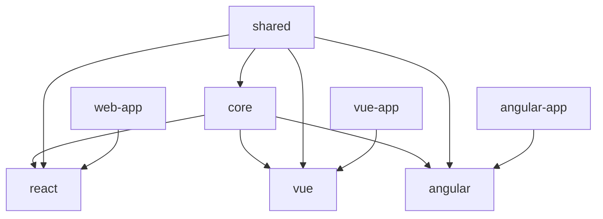

# Next-DrawIO Pro 项目架构实施指南

## 1. 框架无关的核心架构设计

### 1.1 Monorepo 包结构

为了实现跨框架兼容性和模块化开发，我们采用 Monorepo 架构：

```
vector-draw-pro/
├── packages/
│   ├── core/                    # 核心绘图引擎 (框架无关)
│   │   ├── src/
│   │   │   ├── engine/          # Canvas 引擎
│   │   │   ├── objects/         # 图形对象
│   │   │   ├── tools/           # 工具系统
│   │   │   ├── plugins/         # 插件系统
│   │   │   ├── events/          # 事件系统
│   │   │   ├── geometry/        # 几何计算
│   │   │   └── utils/           # 工具函数
│   │   ├── types/              # TypeScript 类型
│   │   └── package.json
│   │
│   ├── react/                   # React 适配器
│   │   ├── src/
│   │   │   ├── components/      # React 组件
│   │   │   ├── hooks/          # React Hooks
│   │   │   ├── adapters/       # React 适配器
│   │   │   └── providers/      # React Context
│   │   └── package.json
│   │
│   ├── vue/                     # Vue 适配器 (未来扩展)
│   │   ├── src/
│   │   │   ├── components/      # Vue 组件
│   │   │   ├── composables/    # Vue Composables
│   │   │   └── adapters/       # Vue 适配器
│   │   └── package.json
│   │
│   ├── angular/                 # Angular 适配器 (未来扩展)
│   │   ├── src/
│   │   │   ├── components/      # Angular 组件
│   │   │   ├── services/       # Angular Services
│   │   │   └── adapters/       # Angular 适配器
│   │   └── package.json
│   │
│   └── shared/                  # 共享工具
│       ├── types/              # 共享类型定义
│       ├── utils/              # 共享工具函数
│       ├── constants/          # 共享常量
│       └── package.json
│
├── apps/
│   ├── web/                     # Next.js Web 应用
│   │   ├── src/
│   │   ├── public/
│   │   └── package.json
│   │
│   ├── docs/                    # 文档网站
│   └── playground/              # 在线演示
│
├── tools/                       # 开发工具
│   ├── build/                  # 构建脚本
│   ├── dev/                    # 开发服务器
│   └── test/                   # 测试工具
│
└── package.json               # 根 package.json
```

### 1.2 核心包依赖关系



## 2. 核心引擎设计 (@vector-draw/core)

### 2.1 核心 API 设计

```typescript
// packages/core/src/engine/CanvasEngine.ts
export interface CanvasEngineOptions {
  canvas: HTMLCanvasElement;
  width?: number;
  height?: number;
  backgroundColor?: string;
  enableHistory?: boolean;
  enableGrid?: boolean;
  enableRulers?: boolean;
  maxObjects?: number;
}

export class CanvasEngine extends EventEmitter {
  public readonly canvas: HTMLCanvasElement;
  public readonly context: CanvasRenderingContext2D;
  
  private objects: Map<string, CanvasObject> = new Map();
  private tools: Map<string, Tool> = new Map();
  private plugins: Map<string, Plugin> = new Map();
  private history: HistoryManager;
  private viewport: ViewportManager;
  private renderer: Renderer;
  private interactionManager: InteractionManager;

  constructor(options: CanvasEngineOptions) {
    super();
    this.initializeCanvas(options);
    this.initializeManagers();
    this.setupEventListeners();
  }

  // 对象管理 API
  addObject(data: ObjectData): string;
  removeObject(id: string): boolean;
  getObject(id: string): CanvasObject | undefined;
  getAllObjects(): CanvasObject[];
  updateObject(id: string, updates: Partial<ObjectData>): boolean;
  
  // 工具管理 API
  registerTool(tool: Tool): void;
  unregisterTool(toolId: string): void;
  setActiveTool(toolId: string): void;
  getActiveTool(): Tool | undefined;
  
  // 插件系统 API
  registerPlugin(plugin: Plugin): void;
  unregisterPlugin(pluginName: string): void;
  getPlugin(name: string): Plugin | undefined;
  
  // 视口操作 API
  setZoom(zoom: number): void;
  setPan(x: number, y: number): void;
  fitToContent(): void;
  resetViewport(): void;
  
  // 渲染控制 API
  render(): void;
  requestRender(): void;
  enableAutoRender(enable: boolean): void;
  
  // 历史管理 API
  undo(): boolean;
  redo(): boolean;
  canUndo(): boolean;
  canRedo(): boolean;
  clearHistory(): void;
  
  // 序列化 API
  serialize(): string;
  deserialize(data: string): void;
  exportAsSVG(): string;
  exportAsPNG(): Blob;
  
  // 生命周期 API
  destroy(): void;
}
```

### 2.2 图形对象系统

```typescript
// packages/core/src/objects/BaseObject.ts
export abstract class BaseObject {
  public readonly id: string;
  public type: ObjectType;
  public visible: boolean = true;
  public locked: boolean = false;
  public opacity: number = 1;
  public blendMode: BlendMode = 'normal';
  
  // 变换属性
  public position: Point = { x: 0, y: 0 };
  public rotation: number = 0;
  public scale: Point = { x: 1, y: 1 };
  public skew: Point = { x: 0, y: 0 };
  
  // 样式属性
  public fill: FillStyle;
  public stroke: StrokeStyle;
  public filter: FilterStyle;
  public shadow: ShadowStyle;

  constructor(data: ObjectData) {
    this.id = data.id || generateId();
    this.type = data.type;
    this.updateFromData(data);
  }

  // 抽象方法
  abstract render(context: RenderContext): void;
  abstract hitTest(point: Point): boolean;
  abstract getBounds(): Bounds;
  abstract clone(): BaseObject;
  
  // 通用方法
  updateFromData(data: Partial<ObjectData>): void;
  toData(): ObjectData;
  applyTransform(transform: Transform): void;
  intersectsWith(other: BaseObject): boolean;
  
  // 事件方法
  onPropertyChanged(property: string, oldValue: any, newValue: any): void;
  onTransformChanged(): void;
  onStyleChanged(): void;
}

// 具体对象实现
export class RectangleObject extends BaseObject {
  public width: number;
  public height: number;
  public cornerRadius: number = 0;

  render(context: RenderContext): void {
    // 渲染矩形
  }
  
  hitTest(point: Point): boolean {
    // 点击测试
  }
  
  getBounds(): Bounds {
    // 获取边界
  }
}

export class CircleObject extends BaseObject {
  public radius: number;

  render(context: RenderContext): void {
    // 渲染圆形
  }
}

export class PathObject extends BaseObject {
  public path: PathData;

  render(context: RenderContext): void {
    // 渲染路径
  }
}

export class TextObject extends BaseObject {
  public text: string;
  public fontSize: number;
  public fontFamily: string;
  public fontWeight: string;
  public fontStyle: string;
  public textAlign: CanvasTextAlign;
  public textBaseline: CanvasTextBaseline;

  render(context: RenderContext): void {
    // 渲染文字
  }
}
```

### 2.3 工具系统

```typescript
// packages/core/src/tools/BaseTool.ts
export abstract class BaseTool {
  public readonly id: string;
  public readonly name: string;
  public readonly icon: string;
  public readonly cursor: string;
  
  protected engine: CanvasEngine;
  protected isActive: boolean = false;
  protected isDrawing: boolean = false;
  protected startPoint: Point | null = null;
  protected currentPoint: Point | null = null;

  constructor(engine: CanvasEngine) {
    this.engine = engine;
  }

  // 工具生命周期
  abstract onActivate(): void;
  abstract onDeactivate(): void;
  
  // 鼠标事件处理
  abstract onMouseDown(event: MouseEvent, context: InteractionContext): boolean;
  abstract onMouseMove(event: MouseEvent, context: InteractionContext): boolean;
  abstract onMouseUp(event: MouseEvent, context: InteractionContext): boolean;
  
  // 键盘事件处理
  onKeyDown(event: KeyboardEvent, context: InteractionContext): boolean;
  onKeyUp(event: KeyboardEvent, context: InteractionContext): boolean;
  
  // 触摸事件处理
  onTouchStart(event: TouchEvent, context: InteractionContext): boolean;
  onTouchMove(event: TouchEvent, context: InteractionContext): boolean;
  onTouchEnd(event: TouchEvent, context: InteractionContext): boolean;
  
  // 工具选项
  setOptions(options: ToolOptions): void;
  getOptions(): ToolOptions;
  
  // 渲染预览
  renderPreview(context: RenderContext): void;
  
  protected createObject(data: ObjectData): CanvasObject;
  protected updateObject(id: string, updates: Partial<ObjectData>): void;
  protected deleteObject(id: string): void;
  protected selectObject(id: string): void;
  protected selectObjects(ids: string[]): void;
}

// 具体工具实现
export class SelectTool extends BaseTool {
  public readonly id = 'select';
  public readonly name = '选择工具';
  public readonly icon = 'cursor-arrow';
  public readonly cursor = 'default';

  onActivate(): void {
    // 激活选择工具
  }

  onMouseDown(event: MouseEvent, context: InteractionContext): boolean {
    // 处理鼠标按下
    return true;
  }

  onMouseMove(event: MouseEvent, context: InteractionContext): boolean {
    // 处理鼠标移动
    return true;
  }

  onMouseUp(event: MouseEvent, context: InteractionContext): boolean {
    // 处理鼠标释放
    return true;
  }
}

export class RectangleTool extends BaseTool {
  public readonly id = 'rectangle';
  public readonly name = '矩形工具';
  public readonly icon = 'square';
  public readonly cursor = 'crosshair';

  onMouseDown(event: MouseEvent, context: InteractionContext): boolean {
    this.startPoint = context.screenToCanvas({ x: event.offsetX, y: event.offsetY });
    this.isDrawing = true;
    return true;
  }

  onMouseMove(event: MouseEvent, context: InteractionContext): boolean {
    if (this.isDrawing && this.startPoint) {
      this.currentPoint = context.screenToCanvas({ x: event.offsetX, y: event.offsetY });
      this.renderPreview(context);
    }
    return true;
  }

  onMouseUp(event: MouseEvent, context: InteractionContext): boolean {
    if (this.isDrawing && this.startPoint && this.currentPoint) {
      const rect = this.calculateRectangle(this.startPoint, this.currentPoint);
      this.createObject({
        type: 'rectangle',
        x: rect.x,
        y: rect.y,
        width: rect.width,
        height: rect.height
      });
    }
    
    this.isDrawing = false;
    this.startPoint = null;
    this.currentPoint = null;
    return true;
  }

  renderPreview(context: RenderContext): void {
    if (this.startPoint && this.currentPoint) {
      const rect = this.calculateRectangle(this.startPoint, this.currentPoint);
      // 绘制预览矩形
    }
  }

  private calculateRectangle(start: Point, end: Point): Rectangle {
    return {
      x: Math.min(start.x, end.x),
      y: Math.min(start.y, end.y),
      width: Math.abs(end.x - start.x),
      height: Math.abs(end.y - start.y)
    };
  }
}
```

### 2.4 事件系统

```typescript
// packages/core/src/events/EventEmitter.ts
export interface EventHandler {
  (data?: any): void;
}

export interface EventMap {
  'object:added': { object: CanvasObject };
  'object:removed': { object: CanvasObject };
  'object:updated': { object: CanvasObject; changes: Partial<ObjectData> };
  'object:selected': { objects: CanvasObject[] };
  'object:deselected': { objects: CanvasObject[] };
  
  'tool:activated': { tool: Tool };
  'tool:deactivated': { tool: Tool };
  'tool:changed': { oldTool: Tool; newTool: Tool };
  
  'viewport:changed': { viewport: ViewportState };
  'viewport:zoomed': { oldZoom: number; newZoom: number; center?: Point };
  'viewport:panned': { delta: Point };
  
  'history:added': { state: HistoryState };
  'history:undone': { state: HistoryState };
  'history:redone': { state: HistoryState };
  
  'render:started': {};
  'render:completed': { duration: number };
  'render:error': { error: Error };
  
  'plugin:loaded': { plugin: Plugin };
  'plugin:unloaded': { plugin: Plugin };
  'plugin:error': { plugin: string; error: Error };
}

export class EventEmitter {
  private listeners: Map<string, EventHandler[]> = new Map();

  on<K extends keyof EventMap>(event: K, handler: EventHandler<EventMap[K]>): void {
    if (!this.listeners.has(event)) {
      this.listeners.set(event, []);
    }
    this.listeners.get(event)!.push(handler);
  }

  off<K extends keyof EventMap>(event: K, handler: EventHandler<EventMap[K]>): void {
    const handlers = this.listeners.get(event);
    if (handlers) {
      const index = handlers.indexOf(handler);
      if (index !== -1) {
        handlers.splice(index, 1);
      }
    }
  }

  once<K extends keyof EventMap>(event: K, handler: EventHandler<EventMap[K]>): void {
    const onceHandler = (data: any) => {
      handler(data);
      this.off(event, onceHandler);
    };
    this.on(event, onceHandler);
  }

  emit<K extends keyof EventMap>(event: K, data?: EventMap[K]): void {
    const handlers = this.listeners.get(event) || [];
    handlers.forEach(handler => {
      try {
        handler(data);
      } catch (error) {
        console.error(`Error in event handler for ${event}:`, error);
      }
    });
  }

  removeAllListeners(event?: string): void {
    if (event) {
      this.listeners.delete(event);
    } else {
      this.listeners.clear();
    }
  }
}
```

## 3. React 适配器实现 (@vector-draw/react)

### 3.1 React Provider 组件

```typescript
// packages/react/src/CanvasProvider.tsx
import React, { useRef, useEffect, createContext, useContext, useMemo } from 'react';
import { CanvasEngine, CanvasEngineOptions } from '@vector-draw/core';
import { ReactAdapter } from './adapters/ReactAdapter';

interface CanvasContextValue {
  engine: CanvasEngine | null;
  adapter: ReactAdapter | null;
  isLoading: boolean;
  error: Error | null;
}

const CanvasContext = createContext<CanvasContextValue>({
  engine: null,
  adapter: null,
  isLoading: true,
  error: null
});

export interface CanvasProviderProps {
  children: React.ReactNode;
  options?: CanvasEngineOptions;
  onEngineReady?: (engine: CanvasEngine) => void;
  onError?: (error: Error) => void;
}

export const CanvasProvider: React.FC<CanvasProviderProps> = ({
  children,
  options,
  onEngineReady,
  onError
}) => {
  const canvasRef = useRef<HTMLCanvasElement>(null);
  const engineRef = useRef<CanvasEngine | null>(null);
  const adapterRef = useRef<ReactAdapter | null>(null);
  const [isLoading, setIsLoading] = React.useState(true);
  const [error, setError] = React.useState<Error | null>(null);

  useEffect(() => {
    if (!canvasRef.current) return;

    try {
      // 创建 canvas 元素
      const canvas = canvasRef.current;
      const engine = new CanvasEngine({
        canvas,
        ...options
      });

      const adapter = new ReactAdapter(engine, canvas);

      engineRef.current = engine;
      adapterRef.current = adapter;

      setIsLoading(false);
      onEngineReady?.(engine);

    } catch (err) {
      const error = err instanceof Error ? err : new Error('Unknown error');
      setError(error);
      setIsLoading(false);
      onError?.(error);
    }

    return () => {
      engineRef.current?.destroy();
    };
  }, [options]);

  const contextValue = useMemo(() => ({
    engine: engineRef.current,
    adapter: adapterRef.current,
    isLoading,
    error
  }), [isLoading, error]);

  return (
    <CanvasContext.Provider value={contextValue}>
      <canvas
        ref={canvasRef}
        style={{
          display: 'block',
          width: '100%',
          height: '100%'
        }}
      />
      {children}
    </CanvasContext.Provider>
  );
};

export const useCanvas = (): CanvasContextValue => {
  const context = useContext(CanvasContext);
  if (!context) {
    throw new Error('useCanvas must be used within a CanvasProvider');
  }
  return context;
};
```

### 3.2 React Hooks

```typescript
// packages/react/src/hooks/useCanvasObject.ts
import { useEffect, useCallback } from 'react';
import { useCanvas } from '../CanvasProvider';

export interface UseCanvasObjectOptions {
  onChange?: (object: any) => void;
  onRemove?: () => void;
}

export const useCanvasObject = (
  id: string,
  options: UseCanvasObjectOptions = {}
) => {
  const { engine } = useCanvas();

  const getObject = useCallback(() => {
    return engine?.getObject(id);
  }, [engine, id]);

  const updateObject = useCallback((updates: any) => {
    return engine?.updateObject(id, updates) ?? false;
  }, [engine, id]);

  const removeObject = useCallback(() => {
    return engine?.removeObject(id) ?? false;
  }, [engine, id]);

  useEffect(() => {
    if (!engine) return;

    const handleObjectUpdated = (event: any) => {
      if (event.object.id === id) {
        options.onChange?.(event.object);
      }
    };

    const handleObjectRemoved = (event: any) => {
      if (event.object.id === id) {
        options.onRemove?.();
      }
    };

    engine.on('object:updated', handleObjectUpdated);
    engine.on('object:removed', handleObjectRemoved);

    return () => {
      engine.off('object:updated', handleObjectUpdated);
      engine.off('object:removed', handleObjectRemoved);
    };
  }, [engine, id, options]);

  return {
    object: getObject(),
    updateObject,
    removeObject
  };
};

// packages/react/src/hooks/useTool.ts
export const useTool = () => {
  const { engine } = useCanvas();

  const setActiveTool = useCallback((toolId: string) => {
    engine?.setActiveTool(toolId);
  }, [engine]);

  const getActiveTool = useCallback(() => {
    return engine?.getActiveTool();
  }, [engine]);

  return {
    activeTool: getActiveTool(),
    setActiveTool
  };
};

// packages/react/src/hooks/useViewport.ts
export const useViewport = () => {
  const { engine } = useCanvas();

  const setZoom = useCallback((zoom: number) => {
    engine?.setZoom(zoom);
  }, [engine]);

  const setPan = useCallback((x: number, y: number) => {
    engine?.setPan(x, y);
  }, [engine]);

  const fitToContent = useCallback(() => {
    engine?.fitToContent();
  }, [engine]);

  const resetViewport = useCallback(() => {
    engine?.resetViewport();
  }, [engine]);

  return {
    setZoom,
    setPan,
    fitToContent,
    resetViewport
  };
};
```

### 3.3 React 组件

```typescript
// packages/react/src/components/Canvas.tsx
import React from 'react';
import { CanvasProvider } from '../CanvasProvider';
import { Toolbar } from './Toolbar';
import { PropertiesPanel } from './PropertiesPanel';
import { LayersPanel } from './LayersPanel';
import { StatusBar } from './StatusBar';
import './Canvas.css';

export interface CanvasProps {
  width?: number;
  height?: number;
  backgroundColor?: string;
  showToolbar?: boolean;
  showProperties?: boolean;
  showLayers?: boolean;
  showStatusBar?: boolean;
  onEngineReady?: (engine: any) => void;
  onError?: (error: Error) => void;
}

export const Canvas: React.FC<CanvasProps> = ({
  width = 800,
  height = 600,
  backgroundColor = '#ffffff',
  showToolbar = true,
  showProperties = true,
  showLayers = true,
  showStatusBar = true,
  onEngineReady,
  onError
}) => {
  return (
    <div className="vdp-canvas" style={{ width, height }}>
      {showToolbar && <Toolbar />}
      
      <div className="vdp-main-area">
        {showLayers && <LayersPanel />}
        
        <div className="vdp-viewport">
          <CanvasProvider
            options={{
              backgroundColor,
              enableHistory: true,
              enableGrid: true,
              enableRulers: true
            }}
            onEngineReady={onEngineReady}
            onError={onError}
          />
        </div>
        
        {showProperties && <PropertiesPanel />}
      </div>
      
      {showStatusBar && <StatusBar />}
    </div>
  );
};

// packages/react/src/components/Toolbar.tsx
export const Toolbar: React.FC = () => {
  const { setActiveTool } = useTool();

  const tools = [
    { id: 'select', name: '选择', icon: '↖' },
    { id: 'rectangle', name: '矩形', icon: '▢' },
    { id: 'circle', name: '圆形', icon: '○' },
    { id: 'text', name: '文字', icon: 'T' },
    { id: 'pen', name: '钢笔', icon: '✏' }
  ];

  return (
    <div className="vdp-toolbar">
      {tools.map(tool => (
        <button
          key={tool.id}
          className="vdp-tool-button"
          title={tool.name}
          onClick={() => setActiveTool(tool.id)}
        >
          {tool.icon}
        </button>
      ))}
    </div>
  );
};
```

## 4. 实施步骤

### 4.1 第一阶段：核心引擎开发 (4-6周)

**Week 1-2: 基础架构**
- 搭建 Monorepo 结构
- 配置 Lerna/Nx 工作空间
- 创建 @vector-draw/core 包
- 实现基础 CanvasEngine 类

**Week 3-4: 图形对象系统**
- 实现 BaseObject 抽象类
- 实现基础图形对象 (矩形、圆形、文字)
- 实现变换系统
- 实现样式系统

**Week 5-6: 工具系统**
- 实现 BaseTool 抽象类
- 实现选择工具
- 实现基础绘图工具
- 实现交互管理系统

### 4.2 第二阶段：React 适配器开发 (3-4周)

**Week 7-8: React 基础组件**
- 创建 @vector-draw/react 包
- 实现 CanvasProvider 组件
- 实现 React Hooks (useCanvas, useTool, useViewport)
- 实现基础 UI 组件

**Week 9-10: 高级功能**
- 实现属性面板
- 实现图层面板
- 实现历史管理
- 实现文件导入导出

### 4.3 第三阶段：完善和优化 (2-3周)

**Week 11-12: 性能优化**
- 实现虚拟化渲染
- 优化大量对象处理
- 实现增量更新
- 内存管理优化

**Week 13: 测试和文档**
- 单元测试覆盖
- 集成测试
- API 文档
- 使用指南

## 5. 开发环境配置

### 5.1 Monorepo 配置

```json
// package.json (根目录)
{
  "name": "vector-draw-pro",
  "private": true,
  "workspaces": [
    "packages/*",
    "apps/*"
  ],
  "scripts": {
    "build": "lerna run build",
    "test": "lerna run test",
    "lint": "lerna run lint",
    "dev": "lerna run dev --parallel",
    "clean": "lerna clean && rm -rf node_modules"
  },
  "devDependencies": {
    "lerna": "^8.0.0",
    "@typescript-eslint/eslint-plugin": "^6.0.0",
    "@typescript-eslint/parser": "^6.0.0",
    "eslint": "^8.0.0",
    "prettier": "^3.0.0",
    "typescript": "^5.0.0"
  }
}
```

### 5.2 TypeScript 配置

```json
// tsconfig.json (根目录)
{
  "compilerOptions": {
    "target": "ES2020",
    "module": "ESNext",
    "moduleResolution": "bundler",
    "strict": true,
    "esModuleInterop": true,
    "skipLibCheck": true,
    "forceConsistentCasingInFileNames": true,
    "declaration": true,
    "declarationMap": true,
    "sourceMap": true,
    "outDir": "dist",
    "rootDir": "src",
    "paths": {
      "@vector-draw/core": ["./packages/core/src"],
      "@vector-draw/react": ["./packages/react/src"]
    }
  },
  "exclude": ["node_modules", "dist", "apps"]
}
```

### 5.3 构建配置

```javascript
// packages/core/vite.config.ts
import { defineConfig } from 'vite';
import { resolve } from 'path';
import dts from 'vite-plugin-dts';

export default defineConfig({
  build: {
    lib: {
      entry: resolve(__dirname, 'src/index.ts'),
      name: 'Next-DrawIOCore',
      fileName: (format) => `vector-draw-core.${format}.js`,
      formats: ['es', 'umd']
    },
    rollupOptions: {
      external: [],
      output: {
        globals: {}
      }
    }
  },
  plugins: [
    dts({
      include: ['src/**/*'],
      exclude: ['src/**/*.test.ts']
    })
  ]
});
```

---

这个架构设计实现了：

1. **框架无关性**：核心绘图引擎完全独立，不依赖任何前端框架
2. **跨框架兼容**：通过适配器模式支持 React、Vue、Angular 等框架
3. **模块化设计**：清晰的包结构和依赖关系
4. **可扩展性**：插件系统支持功能扩展
5. **性能优化**：虚拟化渲染、增量更新等优化策略
6. **开发体验**：完整的 TypeScript 支持和开发工具链

这样的架构可以确保核心功能的可复用性，同时为不同框架提供最佳的开发体验。